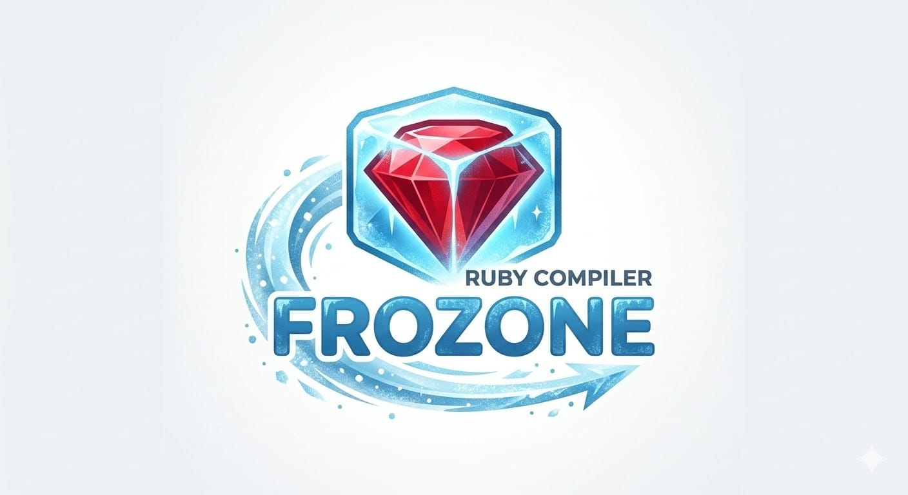

<p align="center">
  
</p>

# Frozone

A Ruby VM implemented in Ruby — with two AoT compiler backends targeting
native binaries.

Frozone is built around a **two-phase model**: a full-featured interpreter
runs the dynamic load phase (metaprogramming, `require`s, runtime-computed
constants), then an AoT compiler snapshots the settled, closed-world result
and emits native code.

## Two AoT backends

Frozone has two AoT backends, written at different points in the project and
with different design priorities. Both consume the same interpreter snapshot.

### First backend — TI-driven Crystal/C++, perf-first (PoC)

The original backend is a two-phase AOT transpiler to Crystal (and later C++),
with **type inference (TI)** as the load-bearing optimization. TI proves
receiver classes, narrows method dispatch, and unlocks primitive
specialisation; the emitted code is close to what a Crystal programmer would
hand-write. We achieved excellent perf on the benchmark suite — see the
numbers below — but the implementation is a proof-of-concept: the TI engine
covers exactly the constructs the benchmarks exercise, and broader Ruby
semantics (full metaprogramming, every corner of method dispatch) are
out-of-scope.

| Benchmark | Crystal | C++ | MRI | YJIT | Best/MRI | Best/YJIT |
|-----------|--------:|----:|----:|-----:|---------:|----------:|
| fib(35) ×3 | 94 | **37** | 2326 | 501 | **63×** | **14×** |
| matmul(200) ×20 | 256 | **82** | 7355 | 2897 | **90×** | **35×** |
| nbody ×100 | **116** | 110 | 7259 | 2644 | **66×** | **24×** |
| nqueens 500×12 | 6566 | **5890** | 198033 | 49711 | **34×** | **8.4×** |
| loops\_times | **123** | 96 | 8675 | — | **90×** | — |
| sudoku ×20 | 418 | **7** | 7151 | 1928 | **1021×** | **276×** |
| blurhash ×10 | **246** | 241 | 2504 | 1057 | **10×** | **4.4×** |
| fannkuchredux ×10 | 857 | **102** | 3217 | 3161 | **32×** | **31×** |
| binarytrees ×60 | **2000** | 4177 | 16244 | 6916 | **8.1×** | **3.5×** |
| str\_concat ×100 | **992** | 2894 | 5248 | 4502 | **5.3×** | **4.5×** |
| splay ×200 | **13835** | 15231 | 20349 | 13417 | **1.5×** | **1.0×** |

Wall-clock milliseconds. Both backends beat YJIT on every compute benchmark
in this set. See [docs/cpp-backend.md](docs/cpp-backend.md) and
[docs/perf-suite.md](docs/perf-suite.md) for architecture and full numbers.

### Second backend — C++, correctness-first

The second C++ backend, under active development, is a fresh restart with
inverted priorities:

- **Correctness over perf.** The goal is full Ruby semantic authenticity —
  every method, every corner of dispatch, every metaprogramming surface
  works the way MRI does. Perf comes later.
- **No TI yet.** Every value is uniformly boxed (`BasicObject*` everywhere).
  No primitive specialisation, no pointer tagging. This trades absolute
  speed for a uniform model that's easier to make correct and easier to
  self-compile.
- **Self-compilation as the forcing function.** The bar is that Frozone
  itself compiles end-to-end under this backend (closed-world AOT of the
  parser, the interpreter, the core library), and the resulting binary can
  parse and run a Ruby program. Anything Frozone uses internally has to
  work; there are no shortcuts.

The architecture is `BasicObject*`-everything, virtual method dispatch via a
universal vtable, with optimisations (natural-args calling convention, leaf
typeid dispatch, snapshot serialisation, per-class translation units) layered
on once correctness is in place. Perf catches up later — once TI is
re-introduced on this foundation, it can specialise from a uniformly-boxed
starting point without having to also relitigate semantics.

Invoke via `FROZONE_BOX_FIRST=1` (internal name retained at the env-var
level). See `docs/box-first-*.md` for the engineering notes.

## Interpreter status

Spec-compliance of the tree-walking interpreter — independent of either AoT
backend:

| | Passing | Total | Rate |
|---|---:|---:|---:|
| ruby/spec language | 2615 | 2630 | 99.4% |
| ruby/spec core | 22708 | 22913 | 99.1% |
| ruby/spec library | 1979 | 2467 | 80% |
| RSpec unit tests | 781 | 781 | 100% |

**Self-hosting:** Frozone runs itself (Frozone²) with no shims. The full
language spec suite passes through Frozone² with identical results. See
[docs/self-hosting.md](docs/self-hosting.md).

The interpreter supports two parser front-ends: [Prism](https://github.com/ruby/prism)
(default) and [whitequark/parser](https://github.com/whitequark/parser)
([Frozone fork](https://github.com/rolandpj1968/parser), invoked with
`--parser=wq`). The whitequark path keeps the interpreter pure Ruby
end-to-end (no C extensions), which is what makes self-hosting tractable.

## Quick start

```bash
# Prerequisites: Ruby 4.0.1 (rbenv install 4.0.1)
git clone --recursive https://github.com/rolandpj1968/frozone.git
cd frozone && bundle install

# Run the interpreter
bundle exec ruby frozone.rb -e "puts 'hello from Frozone'"

# First backend: AoT compile to Crystal or C++ and run
bundle exec ruby frozone.rb --aot bench/stubs/fib.rb
# => Frozone.compile!: wrote crystal/fib.cr
cd crystal && crystal build fib.cr --release -o fib && ./fib

FROZONE_CPP=1 bundle exec ruby frozone.rb --aot bench/stubs/fib.rb
# => Frozone.compile!: wrote cpp/gen/fib.cpp

# Second backend: AoT compile via the correctness-first path
FROZONE_CPP=1 FROZONE_BOX_FIRST=1 bundle exec ruby frozone.rb --aot bench/stubs/fib.rb

# Tests
bundle exec rspec                        # unit tests
bundle exec rake language                # ruby/spec language suite
bundle exec rake core                    # ruby/spec core suite
```

## Documentation

**Interpreter:**
- [docs/interpreter.md](docs/interpreter.md) — VM architecture, parsers
- [docs/self-hosting.md](docs/self-hosting.md) — Frozone², Frozone³, pure-Ruby path
- [docs/spec-status.md](docs/spec-status.md) — detailed ruby/spec results

**First backend (TI-driven, perf-first):**
- [docs/compilation.md](docs/compilation.md) — AoT compiler architecture, type inference, benchmarks
- [docs/cpp-backend.md](docs/cpp-backend.md) — C++ backend: pointer-based object model, shared TI
- [docs/cpp-object-model.md](docs/cpp-object-model.md) — RubyBasicObject hierarchy
- [docs/type-lattice.md](docs/type-lattice.md) — formal type lattice
- [docs/optimisations.md](docs/optimisations.md) — per-optimization flag reference
- [docs/perf-suite.md](docs/perf-suite.md) — benchmark suite + dual-backend perf data

**Second backend (correctness-first):**
- [docs/translation.md](docs/translation.md) — Ruby → C++ translation reference (naive baseline)
- [docs/box-first-cast-audit.md](docs/box-first-cast-audit.md) — cast-by-cast classification + soundness flags
- [docs/box-first-pitfalls.md](docs/box-first-pitfalls.md) — pitfalls / invariants
- [docs/box-first-load-execute-split.md](docs/box-first-load-execute-split.md) — load/execute boundary
- [docs/box-first-layouts-split.md](docs/box-first-layouts-split.md) — headers + per-class TU split
- [docs/box-first-visibility.md](docs/box-first-visibility.md) — method visibility
- [docs/box-first-optimization.md](docs/box-first-optimization.md) — design notes for follow-up optimisations
- [docs/box-first-benchmarks.md](docs/box-first-benchmarks.md) — current (pre-TI) numbers

**Cross-cutting:**
- [docs/gc-design.md](docs/gc-design.md) — GC design: Immix, TLABs, generational, precise
- [docs/reachability-pruning.md](docs/reachability-pruning.md) — closed-world reachability

## Architecture

```
lib/frozone/vm/                VM runtime (ClassObject, Method, Frame, Context, intrinsics)
lib/frozone/ast/               AST nodes evaluated by the tree-walker
lib/frozone/compiler/          AoT compiler (Codegen, TypeInference, CrystalEmitter, CppEmitter)
lib/frozone/compiler/backend/cpp_box/   Second C++ backend
lib/frozone/vm/parser.rb       Prism-based front-end
lib/frozone/vm/wq_parser.rb    whitequark parser front-end (self-hostable path)
lib/core/4.0/                  Ruby stdlib in Ruby — parsed at VM startup, compilable as user code
crystal/src/                   Crystal runtime (RubyObject, RubyInteger, RubyString, …)
cpp/runtime/                   C++ runtime headers (both backends share intrinsics; box-first runtime in cpp/runtime/)
cpp/gen/                       Generated C++ source files
bench/stubs/                   Compilation stubs for benchmarks
bench/specs/                   Compilable spec files
spec/                          RSpec unit tests + ruby-spec integration
```

## Acknowledgements

Frozone builds on the shoulders of several projects and people:

- **[Natalie](https://github.com/natalie-lang/natalie)** — a Ruby implementation that compiles to C++. Natalie demonstrated that a full Ruby implementation could target a compiled language, and its architecture was a key inspiration for Frozone's two-phase (interpret-then-compile) approach.
- **[Chris Coetzee](https://github.com/chriscz)** (`chriscz`) — for the insight that [Crystal](https://crystal-lang.org/) is a better compilation target than C++ for a Ruby compiler. Crystal's Ruby-like syntax and type system make the generated code readable and the type mapping natural, which proved essential for debugging and iterating on the original backend.
- **[Crystal](https://crystal-lang.org/)** — the original AoT compilation backend.
- **[Prism](https://github.com/ruby/prism)** — Ruby's official parser, used as Frozone's primary front-end.
- **[whitequark/parser](https://github.com/whitequark/parser)** ([Frozone fork](https://github.com/rolandpj1968/parser)) — alternative pure-Ruby parser enabling self-hosting without C extensions.
